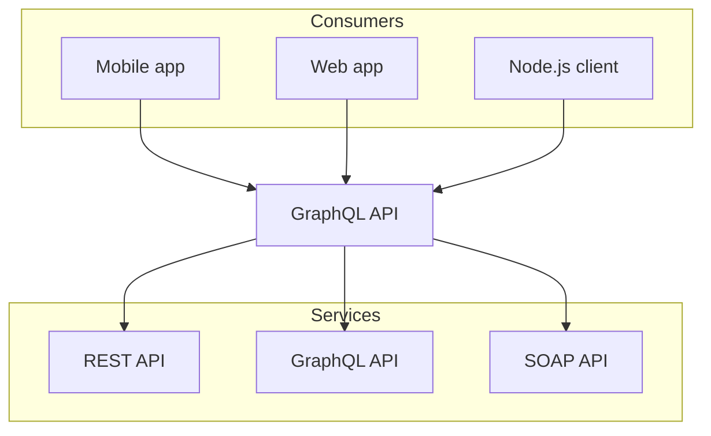

# Mermaid 图表

Nextra 支持 [mermaid](https://mermaid.js.org) 图表。与在 GitHub 上一样，您可以在 Markdown 文件中使用 `mermaid` 代码块语言。Nextra 开箱即用地使用 [`@theguild/remark-mermaid`](https://npmjs.com/package/@theguild/remark-mermaid) 包，该包将代码块替换为 `<Mermaid />` 组件。

## 示例



## 用法

````mdx filename="Markdown"

````
